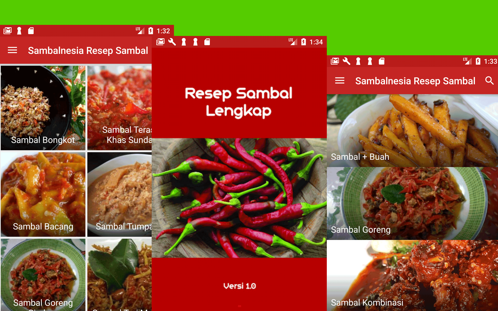

# Sambalnesia
Sambalnesia is an app directory for Sambal. Sambal is a hot sauce or paste typically made from a mixture of a variety of chili peppers with secondary ingredients such as shrimp paste, fish sauce, garlic, ginger, shallot, scallion, palm sugar, lime juice, and rice vinegar or other vinegars. Sambal is an Indonesian loan-word of Javanese origin (sambel). It is native to the cuisines of Indonesia, Malaysia, Sri Lanka, Brunei and Singapore. It has also spread through overseas Indonesian populations to the Netherlands and Suriname.

# ScreenShot

### Download It

#### Made with &#9829;
Follow me on instagram :)
- [@iqbalhood](https://instagram.com/iqbalhood)

### Contribution Process

1. Submit an issue describing your proposed change to the repo in question.
1. The repo owner will respond to your issue promptly.
1. Fork the desired repo, develop and test your code changes.
1. Ensure that your code adheres to the existing style of the library to which
   you are contributing.
1. Ensure that your code has an appropriate set of unit tests which all pass.
1. Submit a pull request and cc @iqbal09
